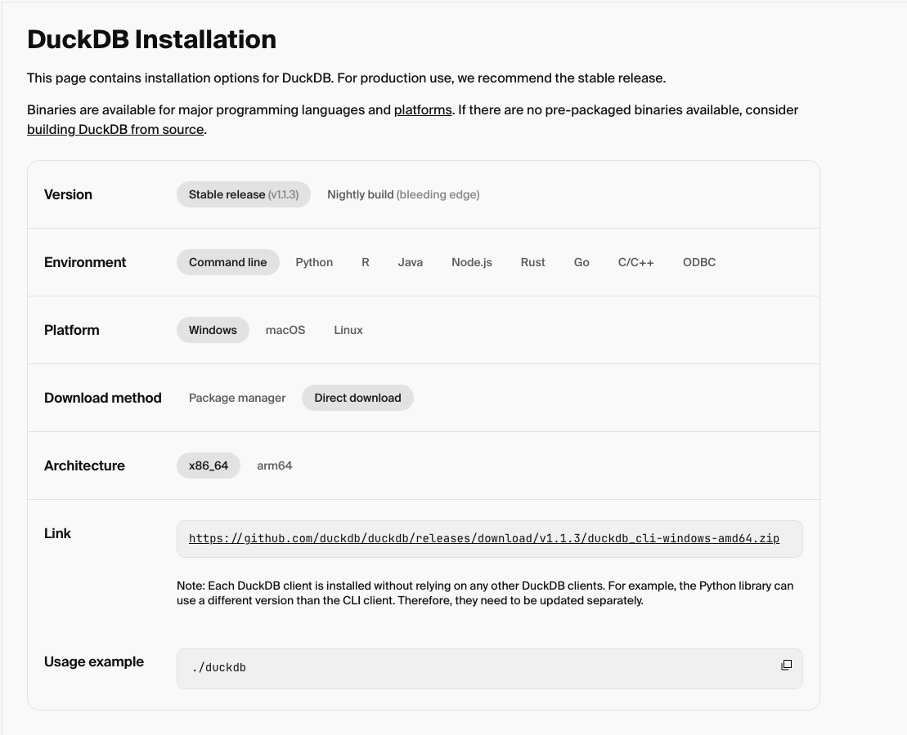

# Game & Highscore database for the LT Arcade

*Please read [Architectual Design Review](./docs/ADR.md#context) for our design choices.*

### Starting the local PROD server
##### Autonomous boot: 
- This is a Windows 10 task scheduler task. There's an XML file located @ `./highscore_database/TaskSchedulerXML/DBServerStart.xml`, if the computer hasn't been setup to boot, open Task Scheduler and import this task. No other options need to be changed.
- The task executes `./highscore_database/scripts/db_server_start.bat`, which runs an `npm ci` command. As such (and a big unfortunately), the server needs an internet connection to run.
    - this can be changed of course, just needs more work.

##### Running manually:
1. Install dependencies via `npm ci` to use exact versions from the `package-lock.json` file
2. Compile the server into the `./dist` folder by running `npm run build`
3. Start the server with `npm start`
    - *Note: if you're running a duckdb terminal session, the server will fail to get a lock on the database.*

### Starting the local DEVL server
- Run `npm run start:debug`. See `package.json` for more details

OR

- Open duckdb executable in your terminal with the persistant database file `npm run start-db:session`
    - The terminal instance is just for SQL query purposes. The RESTful server will make a connection to the binary `*.duckdb` file via the node package.

### Install instructions
#### To standup the database for testing
- On OSX, download with `brew install duckdb`
- On Windows, download the [installer here](https://duckdb.org/docs/installation/?version=stable&environment=cli&platform=win&download_method=direct&architecture=x86_64) and follow the installer wizard.
    - *Note: You don't need to install the .exe or .dmg to use duckDB. You just need the* `*.duckdb` *file and the npm package described in the* `package.json`.
    - *Note^2: Place the `*.duckdb` file on the windows machine @ `C:\Arcade\duckdb\highscore.duckdb` or modify the file `highscore_database/src/services/database.ts` to point to a new location.*
    - *Note^3: If you move the ^^ above repo, you'll might have to revisit the Task Scheduler XML, or build a task yourself.*
- Here are the options I used as of 01/06/2025:



#### Load fake data into the games & highscores tables
- copy the contents of `./database/migrations/1227202400_create_games.sql` and paste it into your terminal's duckdb session (needs to happen first for foreign key dependencies). This will create the `games` table
- copy the contents of `./database/migrations/1227202400_create_highscore.sql` and paste it into your terminal's duckdb session. This will create the `highscore` table
- run `COPY highscores FROM <absolute-path-to-repo>/lt-arcade/highscore_database/database/fake_score_data.csv` in your duckdb terminal session. This will put fake highscore data into the database

#### Clear the database contents for PROD use
- Once you've successfully got the web server up and running, you can clear all the table contents by executing the following commands in the duckdb terminal instance separately. 
```
DELETE FROM highscore;
DELETE FROM games;
```

<br>
<br>
<br>

That's it! The database is ready to go. See the [API docs](./docs/API.docs.md#highscore-database-web-server-api-docs) for more information on consuming the web server's resources in your games.
